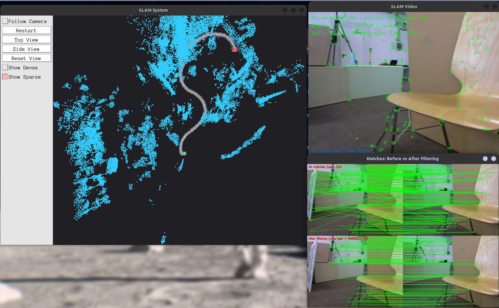
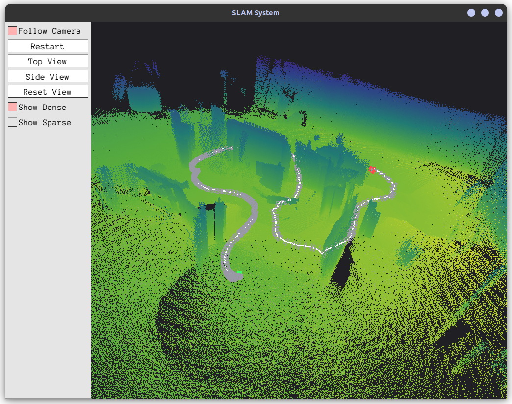
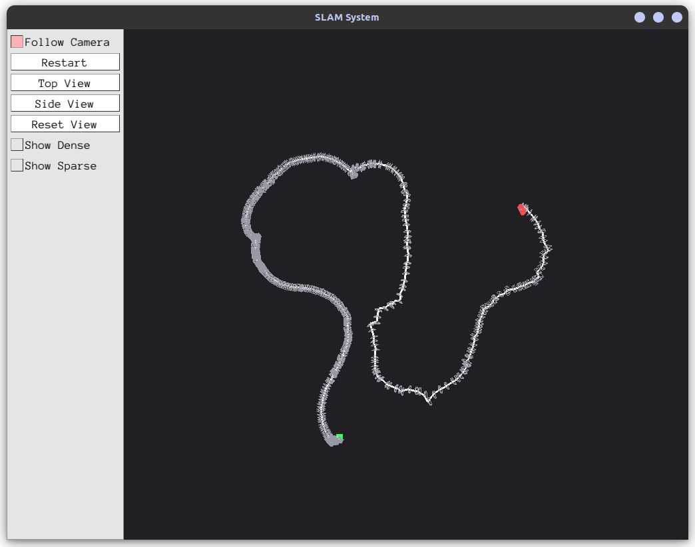
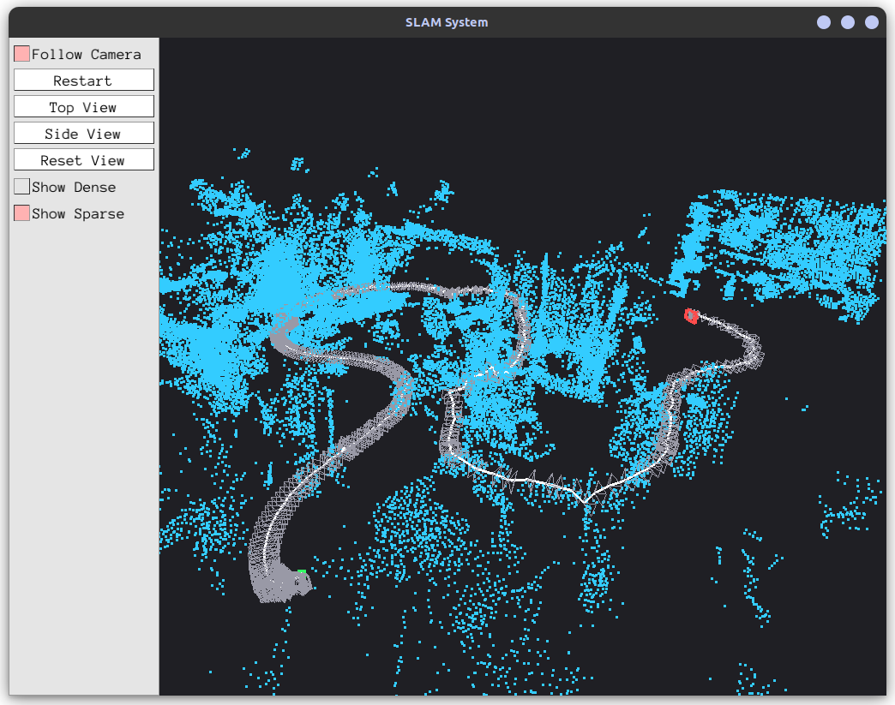

# visual-slam-pipeline

A monocular visual SLAM system built from scratch in C++. Runs on TUM RGB-D sequences and produces trajectory estimates + dense 3D reconstructions in real time.

Tested on the `freiburg2_pioneer_slam3` sequence (2544 frames, indoor ground robot). Achieves **0.109m ATE RMSE** which is competitive with established systems on this difficult sequence.



## What it does

The system takes a sequence of RGB images (with optional depth from a Kinect sensor) and simultaneously estimates the camera trajectory while building a 3D map of the environment. Everything runs in real time with a Pangolin-based 3D viewer.

The pipeline works roughly like this: SuperPoint extracts keypoints and descriptors from each frame, features are matched to the previous keyframe, relative pose is estimated via 3D-3D RANSAC (when depth is available) or Essential matrix decomposition, and an Extended Kalman Filter fuses visual odometry with height constraints from an accelerometer. Every few frames, PnP re-localization corrects drift against the accumulated map. At the end, a pose graph optimization (g2o) and RTS backward smoother refine the full trajectory.

For the 3D map, triangulated sparse points are augmented with dense depth fusion from the Kinect sensor, producing a colored point cloud of ~930K points with 2cm voxel deduplication.

## Screenshots

Dense map (height-colored, viridis):



Top-down view:



Sparse triangulated map:



A full demo video (`full_system_demo.mp4`) is included in the repo.

## Dependencies

- OpenCV 4.x
- Pangolin
- Eigen3
- ONNX Runtime (with CUDA for GPU inference)
- g2o (pose graph optimization)

The SuperPoint and MiDaS ONNX models are not included due to size. You need to place them in `models/`:
- `superpoint_v1.onnx` (~5MB)
- `midas_v21_small_256.onnx` (~64MB)

## Building

```
mkdir build && cd build
cmake ..
make -j$(nproc)
```

## Running

Download a TUM RGB-D dataset and place it next to this directory (the default path expects `../rgbd_dataset_freiburg2_pioneer_slam3/`). Then from the project root:

```
build/slam_system
```

Two windows will open: an OpenCV window showing the current frame with detected keypoints, and a Pangolin 3D viewer with the trajectory and point cloud.

## Project structure

```
src/
  main.cpp          - entry point, data loading, dense cloud accumulation, evaluation
  Slam.cpp          - core SLAM: motion estimation, EKF, keyframe management
  Optimizer.cpp     - Gauss-Newton pose optimization, local BA, g2o pose graph
  FeatureExtractor.cpp - SuperPoint ONNX inference + feature caching
  DepthEstimator.cpp   - MiDaS monocular depth (fallback when no Kinect)
  Frame.cpp         - frame data: image, depth, keypoints, descriptors, pose
  Map.cpp           - map storage: frames + 3D points
  MapPoint.cpp      - 3D landmark with observer tracking
  LoopCloser.cpp    - loop closure detection via feature matching
  Viewer.cpp        - Pangolin visualization
include/            - corresponding headers
evaluate_map.py     - point cloud evaluation against ground truth
```
